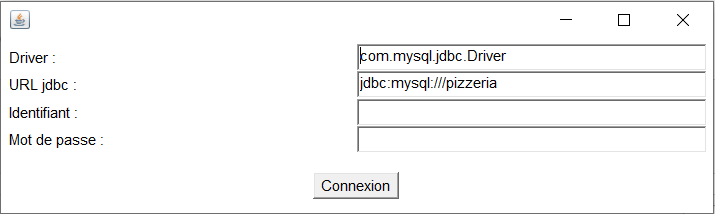

# __Rapport du projet d'IN10-Base de Donnees__

<div align="right"><i>Damien HELIE<br>Vincent BUISSET<br>Julien FAIDIDE<br>Jules LELAY</i></div>

## __Présentation de la base de données__


La base de données ici modélisée simule la gestion d’une entreprise de fabrication et de livraison de pizzas à domicile selon le cahier des charges fourni.<br>
Notre système permet ici la commande de plusieurs pizzas, en plus des fonctionnalités demandées.

## __Installation__

## Ressources

Les ressources sont accessibles à [l'adresse suivante](https://gitlab.com/Pholith/projet-rapizz/-/tree/main/BDD).

## Création et fourniture de la base de données

Lancer les scripts CreateTableFull.sql

## Lancement de l'application

Après compilation des différents fichiers, appeler la méthode main de la classe application.App après avoir téléchargé le projet rapizz. (BDD/IHM/rapizz)

## __Apperçu en fonctionnement__

L'Interface Homme-Machine est décomposée en panneaux, eux-mêmes constitués de deux sous-panneaux haut et bas.  
Le panneau haut est commun à la quasi-totalité de l'application, excepté le panneau de connexion. Le bouton de retour permet de revenir au menu et le bouton de déconnexion ferme la connexion de l'application à la base de données.

## Connexion



Comme on peut s'en douter, la bouton "Connexion" récupère les valeurs entrées dans les champs de texte du panneau afin d'ouvrir la connexion à la base de données.

## Menu


Le menu donne accès, via les boutons associés, aux différents panneaux de l'application.

## Carte


Ce panneau gère la carte de la pizzeria.  
Lors de l'ouverture de la carte, une requête est émise afin de peupler la liste des pizzas disponibles.

## Commande


Ce panneau gère le passage d'une commande.  
Lors de l'appuie sur le bouton de confirmation, la commande décrite par les champs renseignés est injectée en base.

## Livraisons


Ce panneau contient deux listes, contenant respectivement les statistiques des livreurs et des véhicules de livraison.  
Lors de l'ouverture du panneau des livraisons, une requête est émise afin de peupler les deux listes sus-mentionnées.

## Comptabilité

<br>


Ce panneau contient une liste qui, par l'envoi de plusieurs requêtes lors de son ouverture, est peuplée des statistiques de comptabilité de la pizzeria.

## Clients


Enfin, ce panneau récapitule quant à lui les statistiques des différents clients.

## __Programmation__

## IHM

### <u>Application (App.java)</u>

```java
package application;

import java.awt.*;
import java.awt.event.*;
import java.sql.*;

import vue.AppVue;

public class App extends Frame implements ActionListener
{
	AppVue vue;
	Connection conn;
	
	public App()
	{
		super();
		
		this.vue = new AppVue();
		
		this.vue.getBtn_connexion().addActionListener(this);
		this.vue.getBtn_back().addActionListener(this);
		this.vue.getBtn_deco().addActionListener(this);
		this.vue.getBtn_carte().addActionListener(this);
		this.vue.getBtn_commande().addActionListener(this);
		this.vue.getBtn_livraisons().addActionListener(this);
		this.vue.getBtn_compta().addActionListener(this);
		this.vue.getBtn_clients().addActionListener(this);
		this.vue.getBtn_confirme().addActionListener(this);
	}
	
	public void actionPerformed(ActionEvent evt)
	{
		Button source = (Button)evt.getSource();
		if(source == this.vue.getBtn_connexion()) {
			try
			{
				Class.forName(this.vue.getTf_nomDriver().getText());
				this.conn = DriverManager.getConnection(
						 this.vue.getTf_urlConnection().getText(),
						 this.vue.getTf_nomLogin().getText(), this.vue.getTf_motPasse().getText());
				this.vue.setPanel("Menu");
			}
			catch (ClassNotFoundException e)
			{
				System.err.println("erreur a l'execution : Driver");
				e.printStackTrace();
			}
			catch (SQLException e)
			{
				System.err.println("erreur a l'execution : Connexion");
				e.printStackTrace();
			}

		}
		else if(source == this.vue.getBtn_back()) {
			this.vue.setPanel("Menu");
		}
		else if(source == this.vue.getBtn_deco()) {
			try
			{
				this.conn.close();
			}
			catch (SQLException e)
			{
				System.err.println("erreur a l'execution : Dconnexion");
				e.printStackTrace();
			}
			finally
			{
				this.vue.setPanel("Connexion");
			}
		}
		else if(source == this.vue.getBtn_carte()) {
			// TODO : Add Request
			this.vue.setPanel("Carte");
			this.vue.afficheCarte(conn);
		}
		else if(source == this.vue.getBtn_commande()) { 
			this.vue.setPanel("Commande");
		}
		else if(source == this.vue.getBtn_livraisons()) {
			// TODO : Add Request
			this.vue.setPanel("Livraisons");
		}
		else if(source == this.vue.getBtn_compta()) {
			// TODO : Add request
			this.vue.setPanel("Comptabilit");
			this.vue.afficheCompta(conn);
		}
		else if(source == this.vue.getBtn_clients()) {
			// TODO : add request
			this.vue.setPanel("Clients");
		}
		else if(source == this.vue.getBtn_confirme()) {
			// TODO : Injection des donnes en base
			String insert = vue.commander();
			try {
			   Statement stmt = conn.createStatement();
			   System.out.println(insert);
			   if(insert != null)
				   stmt.executeUpdate(insert);
			} catch (SQLException e) {
			   e.printStackTrace();
			}
		}
		this.pack();
	}
	
	public static void main(String[] arg)
	{
		App app;
		
		app = new App();
		app.setSize(600, 400);
		
		app.add(app.vue, BorderLayout.CENTER);
		app.addWindowListener(new WindowAdapter() {
			public void windowClosing(WindowEvent e)
			{
				System.exit(0);
			}} );
		app.setVisible(true);
	}
}
```

### <u>Vue (AppVue.java)</u>

```java
package vue;

import java.awt.*;
import java.sql.Connection;
import java.sql.Date;
import java.sql.ResultSet;
import java.sql.SQLException;
import java.sql.Statement;
import java.text.SimpleDateFormat;

public class AppVue extends Panel {
	
	// parent des panneaux
	private Panel p_haut;
	private Panel p_bas;
	
	// panneau de connexion
	private Panel p_haut_connexion;
	private TextField tf_nomDriver;
	private TextField tf_urlConnection;
	private TextField tf_nomLogin;
	private TextField tf_motPasse;
	private Panel p_bas_connexion;
	private Button btn_connexion;
	
	// panneau haut (hors connexion)
	private Panel p_defautHaut;
	private Button btn_back;
	private Button btn_deco;
	
	// panneau de menu
	private Panel p_menu;
	private Button btn_carte;
	private Button btn_commande;
	private Button btn_livraisons;
	private Button btn_compta;
	private Button btn_clients;
	
	
	// panneau de carte
	private Panel p_carte;
	private List l_carte;
	
	// panneau de commande
	private Panel p_commande;
	private TextField tf_prix;
	private TextField tf_idClient;
	private TextField tf_dateEtHeure;
	private TextField tf_idLivreur;
	private TextField tf_idVehicule;
	private Button btn_confirme;
	
	// panneau des livraisons
	private Panel p_livraisons;
	private List l_livreurs;
	private List l_vehicules;
	
	// panneau de comptabilite
	private Panel p_compta;
	private List l_comptabilite;
	
	// panneau des clients
	private Panel p_clients;
	private List l_clients;
	
	public AppVue() {
		super();
		try {
			creerPanneaux();
			initPanel();
		} catch (Exception e) {
			e.printStackTrace();
		}
	}
	
	private void creerPanneaux() {
		creerPanneauParent();
		creerPanneauConnexion();
		creerPanneauHaut();
		creerPanneauMenu();
		creerPanneauCarte();
		creerPanneauCommande();
		creerPanneauLivraisons();
		creerPanneauComptabilite();
		creerPanneauClients();
	}
	
	/********************************************************/
	/************** Creation du panneau parent **************/
	/********************************************************/	
	private void creerPanneauParent(){		
		this.p_haut = new Panel();
		this.p_bas = new Panel();
		
		this.setLayout(new BorderLayout());
		this.add(this.p_haut, BorderLayout.NORTH);
		this.add(this.p_bas, BorderLayout.SOUTH);
	}
	
	/********************************************************/
	/************ Creation du panneau de connexion **********/
	/********************************************************/	
	private void creerPanneauConnexion(){
		this.p_haut_connexion = new Panel();
		this.tf_nomDriver = new TextField("com.mysql.jdbc.Driver", 32);
		this.tf_urlConnection = new TextField("jdbc:mysql://localhost/projet",32);
		this.tf_nomLogin = new TextField(32);
		this.tf_motPasse = new TextField(32);
		
		
		this.p_haut_connexion.setLayout(new GridLayout(4, 2));
		this.p_haut_connexion.add(new Label("Driver :"));
		this.p_haut_connexion.add(this.tf_nomDriver);
		this.p_haut_connexion.add(new Label("URL jdbc :"));
		this.p_haut_connexion.add(this.tf_urlConnection);
		this.p_haut_connexion.add(new Label("Identifiant :"));
		this.p_haut_connexion.add(this.tf_nomLogin);
		this.p_haut_connexion.add(new Label("Mot de passe :"));
		this.p_haut_connexion.add(this.tf_motPasse);
		
		this.p_bas_connexion = new Panel();
		this.btn_connexion = new Button("Connexion");
		
		this.p_bas_connexion.add(this.btn_connexion);
	}
	
	/********************************************************/
	/*********** Creation du panneau haut par defaut ********/
	/********************************************************/	
	private void creerPanneauHaut(){
		this.p_defautHaut = new Panel();
		this.btn_back = new Button("Retour");
		this.btn_deco = new Button("Dconnexion");
		
		this.p_defautHaut.setLayout(new GridLayout(1, 2, 250, 0));
		this.p_defautHaut.add(this.btn_back);
		this.p_defautHaut.add(this.btn_deco);
	}
	
	/********************************************************/
	/************** Creation du panneau du menu *************/
	/********************************************************/	
	private void creerPanneauMenu(){
		this.p_menu = new Panel();
		this.btn_carte = new Button("Carte");
		this.btn_commande = new Button("Commande");
		this.btn_livraisons = new Button("Livraisons");
		this.btn_compta = new Button("Comptabilit");
		this.btn_clients = new Button("Clients");
		
		this.p_menu.setLayout(new GridLayout(5, 1, 0, 40));
		this.p_menu.add(this.btn_carte);
		this.p_menu.add(this.btn_commande);
		this.p_menu.add(this.btn_livraisons);
		this.p_menu.add(this.btn_compta);
		this.p_menu.add(this.btn_clients);
	}
	
	/********************************************************/
	/************ Creation du panneau de la carte ***********/
	/********************************************************/	
	private void creerPanneauCarte(){
		this.p_carte = new Panel();
		this.l_carte = new List(20);
		
		this.p_carte.add(this.l_carte);
	}
	
	public void afficheCarte(Connection conn) {
		ResultSet resultats = null;
		String requete = "Select nomPizza, nomIngredient, prixDeBase From typepizza NATURAL join est_compose_de NATURAL join ingredient GROUP BY nomPizza Order by prixDeBase ";
		
		try {
		   Statement stmt = conn.createStatement();
		   resultats = stmt.executeQuery(requete);
		   
		   while (resultats.next()) {
			   l_carte.add(resultats.getString(1) + " " + resultats.getString(3) + "");
		   }
		} catch (SQLException e) {
		   System.out.println(e);
		}
	}
	
	/********************************************************/
	/************ Creation du panneau de commande ***********/
	/********************************************************/	
	private void creerPanneauCommande(){
		this.p_commande = new Panel();
		this.tf_prix = new TextField(32);
		this.tf_idClient = new TextField(32);
		this.tf_dateEtHeure = new TextField(32);
		this.tf_idLivreur = new TextField(32);
		this.tf_idVehicule = new TextField(32);
		this.btn_confirme = new Button("Confirmer");
		
		this.p_commande.setLayout(new GridLayout(7, 2));
		this.p_commande.add(new Label("Prix :"));
		this.p_commande.add(this.tf_prix);
		this.p_commande.add(new Label("ID client :"));
		this.p_commande.add(this.tf_idClient);
		this.p_commande.add(new Label("Date et heure :"));
		this.p_commande.add(this.tf_dateEtHeure);
		this.p_commande.add(new Label("ID livreur :"));
		this.p_commande.add(this.tf_idLivreur);
		this.p_commande.add(new Label("ID vehicule :"));
		this.p_commande.add(this.tf_idVehicule);
		this.p_commande.add(btn_confirme, -1);
	}
	
	public String commander() {
		if(tf_prix.getText().isEmpty() || tf_idClient.getText().isEmpty() || tf_dateEtHeure.getText().isEmpty() || tf_idLivreur.getText().isEmpty() || tf_idVehicule.getText().isEmpty()) {
			return null;
		}
		
		Date date = new Date(System.currentTimeMillis());
		String requete = "Insert Into commande Values(NULL, " + tf_prix.getText() + ", "+ tf_idClient.getText() + ", now(), " + tf_idLivreur.getText() + ","
				+ tf_idVehicule.getText() + ")";
		
		return requete;
	}
	
	/********************************************************/
	/********** Creation du panneau des livraisons **********/
	/********************************************************/	
	private void creerPanneauLivraisons(){
		this.p_livraisons = new Panel();
		this.l_livreurs = new List(10);
		this.l_vehicules = new List(10);
		
		this.p_livraisons.setLayout(new GridLayout(2, 1, 0, 20));
		this.p_livraisons.add(this.l_livreurs);
		this.p_livraisons.add(this.l_vehicules);
	}
	
	/********************************************************/
	/********** Creation du panneau de comptabilit *********/
	/********************************************************/	
	private void creerPanneauComptabilite(){
		this.p_compta = new Panel();
		this.l_comptabilite = new List(20);
		
		this.p_compta.add(l_comptabilite);
	}
	
	public void afficheCompta(Connection conn) {
		chiffreAffaire(conn);
		commandeEnCours(conn);
		commandeMoyenne(conn);
		bestClient(conn);
		clientCommandePlusQueMoyenne(conn);
	}
	
	private void chiffreAffaire(Connection conn) {
		ResultSet resultats = null;
		String requete = "Select SUM(prix) as CA from Commande Where dateEtHeure BETWEEN date_add(date_add(LAST_DAY(now()),interval 1 DAY),interval -1 MONTH) AND LAST_DAY(now())";
		
		try {
		   Statement stmt = conn.createStatement();
		   resultats = stmt.executeQuery(requete);
		   
		   
		   if(!resultats.next())
			   l_comptabilite.add("Chiffre d'affaire du dernier mois : 0");
		   else
			   l_comptabilite.add("Chiffre d'affaire du dernier mois : " + resultats.getInt(1) + "");
		   
		} catch (SQLException e) {
		   System.out.println(e);
		}
	}
	
	private void commandeEnCours(Connection conn) {
		ResultSet resultats = null;
		String requete = "Select COUNT(IdCommande) as nbCommande from Commande Where dateEtHeure BETWEEN date_add(date_add(LAST_DAY(now()),interval 1 DAY),interval -1 MONTH) AND LAST_DAY(now())";
		
		try {
		   Statement stmt = conn.createStatement();
		   resultats = stmt.executeQuery(requete);
		   
		   
		   if(!resultats.next())
			   l_comptabilite.add("Nombre de commande du dernier mois : 0");
		   else
			   l_comptabilite.add("Nombre de commande du dernier mois : " + resultats.getInt(1));
		   
		} catch (SQLException e) {
		   System.out.println(e);
		}
	}
	
	private void commandeMoyenne(Connection conn) {
		ResultSet resultats = null;
		String requete = "SELECT COUNT(*) as nb, IdClient FROM commande GROUP BY commande.IdClient";
		
		try {
		   Statement stmt = conn.createStatement();
		   resultats = stmt.executeQuery(requete);
		   
		   while (resultats.next()) {
			   l_comptabilite.add("Client " + resultats.getString(2) + " : " + resultats.getString(1) + " commande(s)");
		   }
		} catch (SQLException e) {
		   System.out.println(e);
		}
	}
	
	private void bestClient(Connection conn) {
		ResultSet resultats = null;
		String requete = "SELECT idClient FROM client ORDER BY pizzaAchetees DESC LIMIT 1";
		
		try {
		   Statement stmt = conn.createStatement();
		   resultats = stmt.executeQuery(requete);
		   
		   
		   if(!resultats.next())
			   l_comptabilite.add("Meilleur client : personne");
		   else
			   l_comptabilite.add("Meilleur client : " + resultats.getString(1));
		   
		} catch (SQLException e) {
		   System.out.println(e);
		}
	}
	
	private void clientCommandePlusQueMoyenne(Connection conn) {
		ResultSet resultats = null;
		String requete = "SELECT IdClient, solde, COUNT(idCommande) as nbCommandes FROM client NATURAL JOIN commande c1 WHERE 1"
				+ " GROUP BY IdClient HAVING nbCommandes > (SELECT avg(cnt.c) FROM (SELECT COUNT(IdCommande) c FROM client NATURAL JOIN commande"
				+ "  GROUp BY client.IdClient) cnt) ORDER BY `nbCommandes`  DESC";
		
		try {
		   Statement stmt = conn.createStatement();
		   resultats = stmt.executeQuery(requete);
		   
		   l_comptabilite.add("Client ayant command plus que la moyenne");
		   
		   while (resultats.next()) {
			   l_comptabilite.add("Client " + resultats.getString(1) + " : " + resultats.getString(3) + " commande(s)");
		   }
		   
		} catch (SQLException e) {
		   System.out.println(e);
		}
	}
	
	/********************************************************/
	/************ Creation du panneau des clients ***********/
	/********************************************************/	
	private void creerPanneauClients(){
		this.p_clients = new Panel();
		this.l_clients = new List(20);
		
		this.p_clients.add(l_clients);
	}	
	
	/********************************************************/
    /*************** Initialisation de l'app ****************/
    /********************************************************/  
	private void initPanel(){ 
		this.p_haut.add(this.p_haut_connexion);
		this.p_bas.add(this.p_bas_connexion);
	}
	
	/********************************************************/
    /**************** Changement de panneau *****************/
    /********************************************************/
	public void setPanel(String panelName) {
		this.p_haut.remove(0);
		this.p_bas.remove(0);
		
		switch (panelName)
		{
			case "Connexion":
				this.p_haut.add(this.p_haut_connexion);
				this.p_bas.add(this.p_bas_connexion);
				break;
				
			case "Menu":
				this.p_haut.add(this.p_defautHaut);
				this.p_bas.add(this.p_menu);
				break;
			
			case "Carte":
				this.p_haut.add(this.p_defautHaut);
				this.p_bas.add(this.p_carte);
				break;
				
			case "Commande":
				this.p_haut.add(this.p_defautHaut);
				this.p_bas.add(this.p_commande);
				break;
			
			case "Livraisons":
				this.p_haut.add(this.p_defautHaut);
				this.p_bas.add(this.p_livraisons);
				break;
	
			case "Comptabilit":
				this.p_haut.add(this.p_defautHaut);
				this.p_bas.add(this.p_compta);
				break;
			
			case "Clients":
				this.p_haut.add(this.p_defautHaut);
				this.p_bas.add(this.p_clients);
				break;
	
			default:
				System.err.println("Changement de panel vers panel inconnu : " + panelName);
				break;
		}
		
		this.p_haut.repaint();
		this.p_bas.repaint();
		this.repaint();
	}


	/********************************************************/
    /************************ Getters ***********************/
    /********************************************************/

	public TextField getTf_nomDriver()
	{
		return tf_nomDriver;
	}

	public TextField getTf_urlConnection()
	{
		return tf_urlConnection;
	}

	public TextField getTf_nomLogin()
	{
		return tf_nomLogin;
	}

	public TextField getTf_motPasse()
	{
		return tf_motPasse;
	}

	public Button getBtn_connexion()
	{
		return btn_connexion;
	}

	public Button getBtn_back()
	{
		return btn_back;
	}

	public Button getBtn_deco()
	{
		return btn_deco;
	}

	public Button getBtn_carte()
	{
		return btn_carte;
	}

	public Button getBtn_commande()
	{
		return btn_commande;
	}

	public Button getBtn_livraisons()
	{
		return btn_livraisons;
	}

	public Button getBtn_compta()
	{
		return btn_compta;
	}

	public Button getBtn_clients()
	{
		return btn_clients;
	}

	public List getL_carte()
	{
		return l_carte;
	}

	public Button getBtn_confirme()
	{
		return btn_confirme;
	}

	public List getL_livreurs()
	{
		return l_livreurs;
	}

	public List getL_vehicules()
	{
		return l_vehicules;
	}

	public List getL_comptabilite()
	{
		return l_comptabilite;
	}

	public List getL_clients()
	{
		return l_clients;
	}

	public TextField getTf_prix()
	{
		return tf_prix;
	}

	public TextField getTf_idClient()
	{
		return tf_idClient;
	}

	public TextField getTf_dateEtHeure()
	{
		return tf_dateEtHeure;
	}

	public TextField getTf_idLivreur()
	{
		return tf_idLivreur;
	}

	public TextField getTf_idVehicule()
	{
		return tf_idVehicule;
	}
}
```

## SQL

### <u>Création et fourniture des tables (CreateTableFull.sql)</u>

```sql
drop TABLE if EXISTS TypePizza;
drop TABLE if EXISTS  Ingredient;
drop TABLE if EXISTS  Livreur;
drop TABLE if EXISTS  Vehicule;
drop TABLE if EXISTS  Client;
drop TABLE if EXISTS  ArticleCommande;
drop TABLE if EXISTS  Commande;
drop TABLE if EXISTS  Est_compose_de;
drop TABLE if EXISTS  Contient;
drop TABLE if EXISTS  Est_pizza;

-- Creation des tables

CREATE TABLE IF NOT EXISTS TypePizza(
   IdPizza INT NOT NULL AUTO_INCREMENT PRIMARY KEY,
   prixDeBase INT NOT NULL check (prixDeBase > 0),
   nomPizza VARCHAR(50)
) DEFAULT CHARSET=utf8 COLLATE=utf8_unicode_ci;

CREATE TABLE IF NOT EXISTS Ingredient(
   IdIngredient INT NOT NULL AUTO_INCREMENT PRIMARY KEY,
   nomIngredient VARCHAR(50)
) DEFAULT CHARSET=utf8 COLLATE=utf8_unicode_ci;

CREATE TABLE IF NOT EXISTS Livreur(
   IdLivreur INT NOT NULL AUTO_INCREMENT PRIMARY KEY,
   nomLivreur VARCHAR(50) NOT NULL,
   prenom VARCHAR(50)
) DEFAULT CHARSET=utf8 COLLATE=utf8_unicode_ci;

CREATE TABLE IF NOT EXISTS Vehicule(
   IdVehicule INT NOT NULL AUTO_INCREMENT PRIMARY KEY,
   marque VARCHAR(50)
) DEFAULT CHARSET=utf8 COLLATE=utf8_unicode_ci;

CREATE TABLE IF NOT EXISTS Client(
   IdClient INT NOT NULL AUTO_INCREMENT PRIMARY KEY,
   nomClient VARCHAR(50) NOT NULL,
   solde INT
) DEFAULT CHARSET=utf8 COLLATE=utf8_unicode_ci;

CREATE TABLE IF NOT EXISTS ArticleCommande(
   IdArticle INT NOT NULL AUTO_INCREMENT PRIMARY KEY,
   nonFacturation INT NOT NULL
) DEFAULT CHARSET=utf8 COLLATE=utf8_unicode_ci;

CREATE TABLE IF NOT EXISTS Commande(
   IdCommande INT NOT NULL AUTO_INCREMENT PRIMARY KEY,
   prix INT NOT null check (prix > 0),
   IdClient INT NOT NULL,
   dateEtHeure DATETIME NOT NULL,
   IdLivreur INT NOT NULL,
   IdVehicule INT NOT null,
   FOREIGN KEY(IdClient) REFERENCES Client(IdClient) ON UPDATE CASCADE ON DELETE SET DEFAULT,
   FOREIGN KEY(IdLivreur) REFERENCES Livreur(IdLivreur) ON UPDATE CASCADE ON DELETE SET DEFAULT,
   FOREIGN KEY(IdVehicule) REFERENCES Vehicule(IdVehicule) ON UPDATE CASCADE ON DELETE SET DEFAULT
) DEFAULT CHARSET=utf8 COLLATE=utf8_unicode_ci;


CREATE TABLE IF NOT EXISTS Est_compose_de(
   IdPizza INT NOT NULL,
   IdIngredient INT NOT NULL,
   FOREIGN KEY(IdPizza) REFERENCES TypePizza(IdPizza) ON UPDATE CASCADE ON DELETE CASCADE,
   FOREIGN KEY(IdIngredient) REFERENCES Ingredient(IdIngredient) ON UPDATE CASCADE ON DELETE CASCADE,
   PRIMARY KEY(IdPizza, IdIngredient)
) DEFAULT CHARSET=utf8 COLLATE=utf8_unicode_ci;


CREATE TABLE IF NOT EXISTS Contient(
   IdArticle INT NOT NULL,
   IdCommande INT NOT NULL,
   FOREIGN KEY(IdArticle) REFERENCES ArticleCommande(IdArticle) ON UPDATE CASCADE ON DELETE CASCADE,
   FOREIGN KEY(IdCommande) REFERENCES Commande(IdCommande) ON UPDATE CASCADE ON DELETE CASCADE,
   PRIMARY KEY(IdArticle, IdCommande)
) DEFAULT CHARSET=utf8 COLLATE=utf8_unicode_ci;


CREATE TABLE IF NOT EXISTS Est_pizza(
   IdArticle INT NOT NULL PRIMARY KEY,
   taillePizza INT NOT null check (taillePizza in (-1, 0, 1)),
   IdPizza INT NOT NULL,
   FOREIGN KEY(IdArticle) REFERENCES ArticleCommande(IdArticle) ON UPDATE CASCADE ON DELETE CASCADE,
   FOREIGN KEY(IdPizza) REFERENCES TypePizza(IdPizza) ON UPDATE CASCADE ON DELETE CASCADE
) DEFAULT CHARSET=utf8 COLLATE=utf8_unicode_ci;


-- Ajout du jeu d'éssai
INSERT INTO TypePizza values 
(null,"9","Marinara"),(null,"12","Sicilienne"),(null,"13","Savoyarde"),(null,"8","Margherita"),(null,"10","Reine"),(null,"14","Calzone"),(null,"7","Capricciosa");

INSERT INTO Livreur values 
(null,"Alain","Marchand"),(null,"Laura","Pierre"),(null,"Camille","Lefevre"),(null,"Quentin","Bertrand"),(null,"David","Dumont"),(null,"Danielle","Petit"),(null,"Marcel","Herve"),(null,"Marion","Lemaire"),(null,"Lucas","Garcia"),(null,"Virginie","Blanc");

INSERT INTO Vehicule values 
(null,"SKODA"),(null,"BENTLEY"),(null,"SUZUKI"),(null,"HUMMER"),(null,"BUGATTI"),(null,"PAGANI"),(null,"MERCEDES"),(null,"LAND-ROVER"),(null,"HONDA"),(null,"SMART");

INSERT INTO Ingredient values 
(null,"Gruyère"),(null,"Wakamé "),(null,"huitre"),(null,"Rhubarbe"),(null,"Yaourt"),(null,"hareng"),(null,"oeuf"),(null,"Violette"),(null,"Tabasco"),(null,"Venaison"),(null,"gingembre"),(null,"escargot"),(null,"lamproie"),(null,"fraise"),(null,"Datte"),(null,"passion (fruit)"),(null,"blé"),(null,"oseille"),(null,"carotte"),(null,"Banane"),(null,"herbes"),(null,"levure"),(null,"Nouilles"),(null,"Sarriette"),(null,"Pain"),(null,"Tofu"),(null,"frites"),(null,"figue"),(null,"fèves"),(null,"orange");

INSERT INTO Client values 
(null,"Bruno","4"),(null,"Pauline","6"),(null,"Luc","9"),(null,"Clément","4"),(null,"Caroline","8"),(null,"Gilbert","9"),(null,"Stéphanie","8"),(null,"Arnaud","9"),(null,"Franck","8"),(null,"Gérard","5"),(null,"Danielle","13"),(null,"Marc","5"),(null,"Maxime","11"),(null,"Alexandre","7"),(null,"René","0"),(null,"Philippe","5"),(null,"Pauline","3"),(null,"Jean-","1"),(null,"Gilbert","1"),(null,"Guy","7"),(null,"Denise","11"),(null,"Isabelle","8"),(null,"Lucien","10"),(null,"Simone","1"),(null,"Marcel","1"),(null,"Lucie","11"),(null,"Martine","14"),(null,"René","8"),(null,"Annick","4"),(null,"Luc","2"),(null,"Andrée","1"),(null,"Stéphanie","9"),(null,"Cécile","2"),(null,"Enzo","14"),(null,"Philippe","10"),(null,"Alain","7"),(null,"Louise","10"),(null,"Henri","12"),(null,"Béatrice","12"),(null,"Florian","11"),(null,"Aurélie","3"),(null,"Guy","13"),(null,"Claire","4"),(null,"Laurent","10"),(null,"Christiane","14"),(null,"Christophe","3"),(null,"Marguerite","3"),(null,"Yvonne","0"),(null,"Romain","6"),(null,"Bernard","4"),(null,"Hervé","4"),(null,"René","5"),(null,"René","13"),(null,"Franck","6"),(null,"Maria","2"),(null,"Christelle","0"),(null,"Maxime","2"),(null,"Mathieu","1"),(null,"Pierre","3"),(null,"Jeremy","4"),(null,"Gisèle","1"),(null,"Cécile","12"),(null,"Stéphane","14"),(null,"Serge","1"),(null,"Sébastien","6"),(null,"Charlotte","7"),(null,"Catherine","2"),(null,"Nicolas","0"),(null,"Benoît","10"),(null,"Joël","12"),(null,"Jeremy","0"),(null,"Marcelle","3"),(null,"Hervé","0"),(null,"Jeannine","3"),(null,"Charles","13"),(null,"Dominique","6"),(null,"Cécile","14"),(null,"Mireille","3"),(null,"Clément","9"),(null,"Jean-","10"),(null,"Ludovic","3"),(null,"Maurice","14"),(null,"Martine","7"),(null,"Victor","10"),(null,"Marc","4"),(null,"Maxime","0"),(null,"Germaine","11"),(null,"Fabrice","4"),(null,"Madeleine","4"),(null,"Yvette","5"),(null,"Cedric","1"),(null,"Jeanne","12"),(null,"Daniel","8"),(null,"Denis","3"),(null,"Claude","10"),(null,"Alain","1"),(null,"Marion","3"),(null,"Claude","0"),(null,"Karine","11"),(null,"Delphine","0"),(null,"Joseph","9"),(null,"Audrey","1"),(null,"Raymond","5"),(null,"Daniel","10"),(null,"Nicolas","8"),(null,"Anne","4"),(null,"Ludovic","11"),(null,"Sandrine","5"),(null,"Béatrice","7"),(null,"Ludovic","10"),(null,"Gilbert","11"),(null,"Stéphanie","6"),(null,"Paul","1"),(null,"Danielle","11"),(null,"Stéphane","5"),(null,"Guy","5"),(null,"Roger","3"),(null,"Pascal","13"),(null,"Bruno","11"),(null,"Bruno","14"),(null,"Michel","8"),(null,"Manon","11"),(null,"Quentin","5"),(null,"Brigitte","5"),(null,"Arnaud","8"),(null,"Evelyne","5"),(null,"Georges","8"),(null,"Catherine","0"),(null,"Ludovic","14"),(null,"Christiane","0"),(null,"Nathalie","6"),(null,"Renée","10"),(null,"Luc","13"),(null,"Vincent","9"),(null,"Odette","4"),(null,"Jeremy","1"),(null,"Catherine","13"),(null,"Elodie","0"),(null,"Georges","7"),(null,"Dominique","11"),(null,"Alexis","3"),(null,"Michelle","11"),(null,"Guillaume","0"),(null,"Marguerite","8"),(null,"Christine","4"),(null,"René","7"),(null,"Gilles","7"),(null,"Fernand","8"),(null,"Maurice","12"),(null,"Cedric","14"),(null,"Delphine","11"),(null,"Karine","7"),(null,"Elodie","12"),(null,"Alexandre","4"),(null,"Annick","5"),(null,"Marc","6"),(null,"David","12"),(null,"Bruno","8"),(null,"Maurice","13"),(null,"Laura","13"),(null,"Laurent","6"),(null,"Thérèse","8"),(null,"Jean","1"),(null,"Sylvain","4"),(null,"Christelle","9"),(null,"Anaïs","14"),(null,"Marcelle","7"),(null,"Jacques","9"),(null,"Pauline","13"),(null,"Elodie","1"),(null,"Yves","10"),(null,"Nathalie","2"),(null,"Henri","1"),(null,"Madeleine","10"),(null,"Anthony","13"),(null,"Valérie","0"),(null,"Joseph","12"),(null,"Yvonne","3"),(null,"Renée","11"),(null,"Frédéric","12"),(null,"Eric","7"),(null,"Kevin","12"),(null,"Colette","4"),(null,"Albert","14"),(null,"Christophe","5"),(null,"Pauline","8"),(null,"Patricia","5"),(null,"Camille","13"),(null,"Michelle","0"),(null,"Joël","11"),(null,"Raymond","12"),(null,"Laura","6"),(null,"Patricia","13"),(null,"Jean-","12"),(null,"Raphaël","13"),(null,"Jeanne","3"),(null,"Danielle","12"),(null,"Christophe","14"),(null,"Elodie","5"),(null,"Audrey","12");

INSERT INTO est_compose_de values 
("1","18"),("5","28"),("2","10"),("6","7"),("5","26"),("3","19"),("4","2"),("5","18"),("1","9"),("1","12"),("3","22"),("3","4"),("4","17"),("2","25"),("5","21"),("0","0"),("0","26"),("2","19"),("6","12"),("4","7"),("6","17"),("0","4"),("5","29"),("1","14"),("2","18"),("5","10"),("0","11"),("2","12"),("0","21"),("1","23");

INSERT INTO Commande values 
(null,"18","36","18:09:30:00:47:00","8","6"),(null,"15","169","02:02:19:20:53:00","7","9"),(null,"21","190","05:07:11:07:37:00","0","7"),(null,"20","128","10:07:19:10:30:00","5","3"),(null,"17","110","15:04:21:01:52:00","0","3"),(null,"26","162","15:02:29:18:32:00","3","2"),(null,"17","185","07:07:05:20:07:00","1","1"),(null,"15","153","04:07:28:09:32:00","3","5"),(null,"17","184","17:03:26:19:40:00","6","5"),(null,"10","68","14:04:06:17:12:00","1","2"),(null,"18","29","16:07:00:00:18:00","3","3"),(null,"27","101","14:07:08:18:59:00","4","7"),(null,"18","153","16:02:02:06:59:00","5","6"),(null,"22","26","09:04:06:14:39:00","9","4"),(null,"25","102","20:05:09:19:05:00","0","9"),(null,"19","78","10:07:14:22:33:00","4","3"),(null,"19","11","05:02:22:14:01:00","1","7"),(null,"14","175","06:02:21:10:23:00","7","2"),(null,"25","111","05:01:21:06:55:00","5","1"),(null,"22","174","14:01:12:11:42:00","0","9"),(null,"27","50","13:07:18:02:17:00","6","4"),(null,"28","115","07:08:29:18:33:00","4","9"),(null,"19","104","06:06:18:14:52:00","0","3"),(null,"17","175","17:02:04:01:55:00","7","3"),(null,"25","133","08:11:14:15:27:00","6","7"),(null,"14","160","10:01:29:23:49:00","8","3"),(null,"21","157","08:06:09:02:08:00","5","4"),(null,"14","42","20:09:27:08:43:00","6","8"),(null,"22","166","07:08:29:18:33:00","8","7"),(null,"14","168","02:07:08:02:54:00","2","7"),(null,"24","187","01:10:04:19:00:00","7","1"),(null,"14","187","17:03:26:19:40:00","9","2"),(null,"12","117","02:08:05:20:04:00","0","3"),(null,"24","124","14:08:29:11:30:00","5","1"),(null,"13","135","13:08:20:19:14:00","9","7"),(null,"28","124","10:02:20:04:43:00","9","4"),(null,"17","26","11:02:03:04:01:00","1","6"),(null,"23","190","09:05:12:07:18:00","4","2"),(null,"15","10","18:09:30:00:47:00","3","7"),(null,"11","132","20:05:04:00:41:00","5","0"),(null,"22","144","13:04:10:11:11:00","1","5"),(null,"10","128","10:11:22:23:11:00","9","2"),(null,"21","95","18:08:07:03:31:00","4","8"),(null,"29","169","16:08:10:13:27:00","4","6"),(null,"25","85","02:07:08:02:54:00","2","8"),(null,"12","86","19:02:03:04:31:00","1","6"),(null,"15","134","05:02:03:00:54:00","9","8"),(null,"23","3","11:06:21:21:16:00","5","5"),(null,"10","4","09:06:03:08:41:00","2","6"),(null,"25","166","04:01:11:17:30:00","5","7"),(null,"14","125","10:02:20:04:43:00","8","2"),(null,"13","10","07:11:02:03:49:00","2","4"),(null,"22","146","14:10:28:21:10:00","2","9"),(null,"28","112","03:03:25:14:09:00","5","2"),(null,"29","46","11:03:11:02:29:00","9","6"),(null,"24","38","10:07:04:02:10:00","6","0"),(null,"15","130","18:01:24:12:32:00","4","4"),(null,"22","42","16:08:10:13:27:00","6","6"),(null,"22","39","07:05:24:04:32:00","1","9"),(null,"15","53","08:09:12:04:22:00","2","7"),(null,"14","104","05:08:08:04:13:00","2","7"),(null,"29","33","04:04:25:15:03:00","2","5"),(null,"29","124","20:09:27:08:43:00","2","1"),(null,"29","64","15:05:22:03:09:00","8","3"),(null,"24","105","11:11:27:00:28:00","9","6"),(null,"25","182","07:05:24:04:32:00","9","3"),(null,"19","47","06:05:29:03:42:00","8","8"),(null,"25","92","14:08:29:11:30:00","6","4"),(null,"19","137","15:04:06:04:10:00","0","6"),(null,"29","0","17:07:16:05:46:00","9","9"),(null,"29","187","03:08:17:22:02:00","9","0"),(null,"24","169","11:06:16:15:14:00","6","9"),(null,"11","168","08:04:13:12:57:00","8","0"),(null,"25","95","04:02:01:08:44:00","4","3"),(null,"19","40","05:07:09:20:07:00","3","8"),(null,"10","148","10:07:25:18:32:00","2","6"),(null,"25","165","11:03:08:03:40:00","9","3"),(null,"20","16","07:10:13:23:27:00","8","1"),(null,"28","38","07:04:21:14:34:00","6","4"),(null,"22","28","05:02:22:14:01:00","0","9"),(null,"20","137","03:09:28:00:59:00","6","5"),(null,"25","54","08:03:06:07:59:00","1","0"),(null,"29","51","03:07:06:03:56:00","0","2"),(null,"14","100","18:11:19:21:55:00","5","5"),(null,"23","60","17:11:02:03:05:00","3","4"),(null,"16","153","20:07:24:22:48:00","8","2"),(null,"27","170","15:10:05:11:58:00","3","1"),(null,"11","34","06:05:03:17:29:00","4","6"),(null,"15","45","11:10:04:21:28:00","8","1"),(null,"23","30","04:05:15:18:47:00","4","1"),(null,"12","117","12:04:03:11:40:00","4","2"),(null,"14","47","08:10:01:15:03:00","1","2"),(null,"29","55","09:07:01:04:18:00","9","1"),(null,"12","133","03:05:29:05:20:00","9","1"),(null,"11","153","07:08:11:08:33:00","8","3"),(null,"19","51","08:10:01:14:12:00","1","7"),(null,"12","77","20:05:17:10:51:00","6","0"),(null,"15","96","06:05:29:03:42:00","0","9"),(null,"26","168","01:09:21:11:06:00","2","6"),(null,"29","49","17:10:24:03:21:00","7","0"),(null,"29","86","17:03:15:10:40:00","3","1"),(null,"17","104","09:03:16:12:26:00","1","7"),(null,"28","128","14:02:07:14:53:00","3","0"),(null,"22","147","15:09:17:09:00:00","8","8"),(null,"22","104","18:11:14:20:42:00","0","2"),(null,"14","38","04:01:11:17:30:00","2","3"),(null,"14","27","08:04:16:07:06:00","1","7"),(null,"24","188","06:08:24:17:29:00","5","7"),(null,"25","1","20:07:12:09:42:00","3","9"),(null,"14","140","18:08:07:03:31:00","2","0"),(null,"14","188","07:04:28:06:15:00","9","3"),(null,"19","160","15:09:26:21:40:00","0","9"),(null,"13","148","17:02:05:07:16:00","8","5"),(null,"26","157","18:10:18:02:25:00","5","3"),(null,"23","103","14:04:06:17:12:00","1","0"),(null,"22","102","12:08:03:00:14:00","0","0"),(null,"20","194","08:04:13:12:57:00","2","0"),(null,"15","171","14:06:13:08:46:00","7","3"),(null,"28","104","02:06:04:11:19:00","6","5"),(null,"10","160","16:02:10:13:09:00","7","1"),(null,"18","146","03:09:28:00:59:00","9","3"),(null,"24","37","17:03:26:19:40:00","8","7"),(null,"29","96","18:06:04:07:10:00","9","3"),(null,"13","39","14:06:13:08:46:00","7","3"),(null,"28","168","19:07:09:12:43:00","2","4"),(null,"12","66","13:02:02:11:16:00","5","0"),(null,"26","61","20:04:11:22:20:00","9","6"),(null,"25","64","11:10:12:05:45:00","9","3"),(null,"11","139","09:04:06:14:39:00","0","3"),(null,"18","33","02:06:29:21:26:00","2","3"),(null,"26","172","06:08:27:16:33:00","4","2"),(null,"21","111","18:01:24:12:32:00","4","1"),(null,"17","16","08:10:01:14:12:00","8","9"),(null,"23","180","10:02:20:04:43:00","3","5"),(null,"27","110","19:02:01:09:20:00","3","2"),(null,"15","151","16:04:29:02:18:00","8","9"),(null,"29","21","17:08:11:16:29:00","2","1"),(null,"29","161","06:05:29:03:42:00","6","0"),(null,"14","182","18:08:25:02:14:00","7","9"),(null,"29","20","11:10:27:11:19:00","1","6"),(null,"20","141","09:11:03:18:12:00","6","4"),(null,"15","167","02:08:05:20:04:00","1","9"),(null,"26","82","15:09:12:09:51:00","4","2"),(null,"15","48","03:07:03:00:20:00","6","9"),(null,"27","151","07:01:04:09:00:00","2","3"),(null,"29","77","01:04:08:05:00:00","3","2"),(null,"13","99","11:10:04:21:28:00","1","4"),(null,"15","36","03:08:17:22:02:00","7","9"),(null,"12","127","10:07:19:10:30:00","7","2"),(null,"26","78","12:06:26:02:27:00","5","7"),(null,"25","142","10:03:11:01:39:00","1","8"),(null,"25","188","20:02:09:12:38:00","3","5"),(null,"27","107","13:07:18:02:17:00","9","8"),(null,"16","74","02:05:20:23:40:00","0","9"),(null,"11","17","05:07:09:20:07:00","7","8"),(null,"14","161","20:07:03:22:21:00","9","5"),(null,"21","138","11:02:14:09:11:00","6","4"),(null,"18","173","02:10:04:14:49:00","3","7"),(null,"16","95","10:10:20:16:08:00","2","0"),(null,"21","158","05:04:29:15:05:00","9","9"),(null,"19","14","13:04:29:04:46:00","5","6"),(null,"23","9","19:02:03:04:31:00","2","6"),(null,"29","182","03:02:04:13:37:00","8","9"),(null,"13","149","09:06:03:08:41:00","4","3"),(null,"19","93","19:06:11:04:00:00","2","6"),(null,"22","52","08:08:08:04:04:00","6","2"),(null,"18","162","09:05:00:07:15:00","0","0"),(null,"19","1","06:08:24:17:29:00","9","8"),(null,"17","190","14:01:12:11:42:00","7","7"),(null,"18","145","16:10:21:13:53:00","2","8"),(null,"26","111","19:07:08:14:27:00","5","4"),(null,"29","20","03:05:19:12:02:00","9","0"),(null,"18","116","08:07:27:12:27:00","0","2"),(null,"12","161","10:03:18:02:32:00","7","4"),(null,"13","104","16:06:12:01:45:00","6","9"),(null,"20","172","09:06:03:08:41:00","5","1"),(null,"27","48","14:07:08:18:59:00","8","4"),(null,"27","58","18:07:08:19:40:00","5","0"),(null,"17","121","11:05:26:16:36:00","9","4"),(null,"26","145","02:06:26:01:56:00","5","6"),(null,"22","197","02:04:11:11:17:00","8","6"),(null,"16","59","12:05:00:16:06:00","5","9"),(null,"12","173","09:10:08:03:59:00","7","1"),(null,"13","74","01:03:20:12:28:00","6","3"),(null,"27","54","06:08:24:17:29:00","6","0"),(null,"21","51","13:08:20:19:14:00","2","1"),(null,"25","62","09:09:29:13:46:00","9","5"),(null,"28","191","14:09:23:16:21:00","2","0"),(null,"21","83","10:07:19:10:30:00","5","9"),(null,"20","149","01:11:10:08:55:00","8","2"),(null,"18","72","02:10:04:14:49:00","1","7"),(null,"16","153","04:07:25:07:49:00","7","0"),(null,"11","0","16:10:26:13:47:00","4","2"),(null,"26","32","05:02:03:00:54:00","1","2"),(null,"14","192","10:08:09:22:15:00","5","7"),(null,"18","64","01:04:19:12:44:00","6","5"),(null,"26","153","17:11:02:03:05:00","9","7"),(null,"18","81","15:09:12:09:51:00","1","2"),(null,"12","60","02:07:08:02:54:00","1","0"),(null,"21","153","19:03:05:05:32:00","3","1"),(null,"17","166","10:11:04:03:17:00","6","0"),(null,"19","47","18:03:28:11:39:00","4","3"),(null,"10","14","10:01:29:23:49:00","2","2"),(null,"15","110","11:11:27:00:28:00","6","8"),(null,"17","128","10:02:09:10:03:00","9","0"),(null,"28","58","14:01:19:02:12:00","5","2"),(null,"23","157","11:08:10:07:56:00","4","1"),(null,"10","94","09:11:08:15:33:00","9","2"),(null,"13","14","09:05:00:07:15:00","8","2"),(null,"11","63","17:11:02:03:05:00","9","7"),(null,"10","18","08:04:16:07:06:00","5","7"),(null,"24","20","15:05:22:03:09:00","5","1"),(null,"13","60","03:01:23:13:20:00","2","6"),(null,"14","137","19:11:24:21:18:00","0","1"),(null,"26","143","14:10:28:21:10:00","4","6"),(null,"16","108","15:05:22:09:06:00","7","0"),(null,"21","167","10:07:19:10:30:00","8","1"),(null,"21","187","19:02:18:10:17:00","7","4"),(null,"28","29","10:11:04:03:17:00","7","0"),(null,"27","57","07:08:00:11:23:00","2","9"),(null,"17","164","07:07:11:00:47:00","7","9"),(null,"15","67","07:04:21:14:34:00","8","4"),(null,"13","52","20:04:11:22:20:00","5","5"),(null,"16","70","14:01:00:04:30:00","0","0"),(null,"15","161","07:02:01:12:51:00","5","2"),(null,"23","85","10:01:29:23:49:00","3","7"),(null,"10","129","19:10:05:04:01:00","7","6"),(null,"25","86","04:06:07:09:38:00","9","9"),(null,"14","99","13:09:22:23:27:00","2","2"),(null,"22","113","06:02:05:17:19:00","2","7"),(null,"20","65","05:02:22:14:01:00","1","6"),(null,"21","9","15:06:26:05:33:00","4","2"),(null,"27","69","07:01:22:02:42:00","1","4"),(null,"20","132","10:10:20:16:08:00","8","8"),(null,"28","39","16:08:10:13:27:00","0","8"),(null,"25","159","20:07:01:23:08:00","3","6"),(null,"12","132","15:04:06:04:10:00","5","2"),(null,"24","151","19:06:29:01:34:00","0","0"),(null,"24","125","05:06:23:06:49:00","6","0"),(null,"27","78","07:08:00:11:23:00","8","7"),(null,"29","148","19:02:18:10:17:00","3","8"),(null,"16","58","03:01:23:13:20:00","3","9"),(null,"25","107","19:11:22:23:09:00","8","1"),(null,"13","112","16:05:14:16:26:00","8","7"),(null,"25","49","07:01:04:09:00:00","8","0"),(null,"15","106","11:03:08:03:40:00","0","9"),(null,"18","180","07:01:23:22:15:00","5","6"),(null,"17","155","11:08:10:07:56:00","7","9"),(null,"18","193","16:07:00:00:18:00","1","2"),(null,"13","29","07:07:05:20:07:00","5","8"),(null,"16","176","12:04:05:19:14:00","1","9"),(null,"24","195","06:11:28:11:49:00","3","5"),(null,"25","190","03:11:15:20:48:00","4","4"),(null,"27","175","03:05:30:04:47:00","1","7"),(null,"18","35","03:02:04:13:37:00","9","2"),(null,"26","39","11:06:21:21:16:00","5","9"),(null,"12","143","11:06:25:23:15:00","2","5"),(null,"20","176","19:07:08:14:27:00","6","9"),(null,"17","143","05:08:09:05:40:00","2","1"),(null,"19","46","01:08:04:13:38:00","6","4"),(null,"15","50","16:10:26:13:47:00","8","4"),(null,"13","25","11:05:25:20:37:00","8","1"),(null,"20","73","19:03:05:05:32:00","4","4"),(null,"11","38","04:04:25:15:03:00","8","9"),(null,"29","71","17:02:25:17:13:00","2","3"),(null,"24","20","20:05:17:10:51:00","8","8"),(null,"21","119","03:11:01:02:12:00","1","6"),(null,"27","13","14:06:13:08:46:00","7","4"),(null,"17","163","15:04:21:01:52:00","4","4"),(null,"10","36","02:07:08:02:54:00","7","0"),(null,"15","142","11:02:03:04:01:00","6","4"),(null,"28","196","14:09:23:16:21:00","4","7"),(null,"11","117","15:07:19:01:25:00","0","5"),(null,"28","82","15:09:26:21:40:00","7","5"),(null,"10","50","10:03:18:02:32:00","4","5"),(null,"13","136","07:07:05:20:07:00","8","3"),(null,"20","87","01:11:08:21:00:00","7","5"),(null,"27","171","11:06:16:15:14:00","6","6"),(null,"28","131","03:08:27:01:47:00","0","3"),(null,"26","115","11:04:21:02:25:00","8","4"),(null,"22","152","07:01:04:06:38:00","2","0"),(null,"10","194","04:02:01:08:44:00","0","2"),(null,"15","32","08:08:05:20:46:00","1","2"),(null,"22","168","09:07:07:20:16:00","4","7"),(null,"11","27","16:01:29:12:47:00","1","6"),(null,"16","152","11:11:27:00:28:00","0","7"),(null,"21","2","03:11:01:02:12:00","3","7"),(null,"25","112","14:06:09:17:08:00","7","5"),(null,"27","108","07:10:13:23:27:00","4","4"),(null,"24","16","11:08:10:07:56:00","8","7"),(null,"29","21","08:07:27:12:27:00","1","3"),(null,"19","7","01:11:08:21:00:00","6","7"),(null,"15","59","16:06:12:01:45:00","3","6"),(null,"14","42","16:02:10:13:09:00","3","4"),(null,"11","71","11:06:25:23:15:00","8","8"),(null,"20","192","07:04:28:06:15:00","7","8"),(null,"15","75","06:05:15:03:18:00","2","8"),(null,"19","156","10:10:20:16:08:00","9","2"),(null,"24","163","08:03:06:07:59:00","0","2"),(null,"21","57","09:08:24:00:32:00","7","1");

INSERT INTO ArticleCommande values 
(null,"2"),(null,"35"),(null,"0"),(null,"0"),(null,"10"),(null,"4"),(null,"0"),(null,"0"),(null,"0"),(null,"35"),(null,"2"),(null,"15"),(null,"0"),(null,"10"),(null,"0"),(null,"35"),(null,"1"),(null,"120"),(null,"2"),(null,"0"),(null,"1"),(null,"0"),(null,"0"),(null,"0"),(null,"10"),(null,"0"),(null,"2"),(null,"15"),(null,"3"),(null,"0"),(null,"0"),(null,"0"),(null,"1"),(null,"3"),(null,"0"),(null,"0"),(null,"0"),(null,"0"),(null,"3"),(null,"0"),(null,"0"),(null,"0"),(null,"2"),(null,"0"),(null,"15"),(null,"120"),(null,"15"),(null,"0"),(null,"3"),(null,"0"),(null,"0"),(null,"0"),(null,"0"),(null,"4"),(null,"5"),(null,"0"),(null,"5"),(null,"50"),(null,"5"),(null,"1"),(null,"0"),(null,"3"),(null,"10"),(null,"0"),(null,"4"),(null,"0"),(null,"0"),(null,"1"),(null,"0"),(null,"0"),(null,"2"),(null,"0"),(null,"0"),(null,"0"),(null,"0"),(null,"0"),(null,"30"),(null,"0"),(null,"0"),(null,"15"),(null,"1"),(null,"0"),(null,"0"),(null,"0"),(null,"0"),(null,"50"),(null,"15"),(null,"30"),(null,"35"),(null,"0"),(null,"10"),(null,"0"),(null,"5"),(null,"0"),(null,"0"),(null,"3"),(null,"10"),(null,"2"),(null,"2"),(null,"0"),(null,"5"),(null,"0"),(null,"15"),(null,"1"),(null,"35"),(null,"0"),(null,"120"),(null,"0"),(null,"4"),(null,"5"),(null,"0"),(null,"3"),(null,"3"),(null,"50"),(null,"0"),(null,"10"),(null,"0"),(null,"3"),(null,"35"),(null,"5"),(null,"4"),(null,"0"),(null,"4"),(null,"0"),(null,"0"),(null,"0"),(null,"0"),(null,"0"),(null,"0"),(null,"0"),(null,"0"),(null,"0"),(null,"3"),(null,"120"),(null,"0"),(null,"0"),(null,"4"),(null,"10"),(null,"0"),(null,"0"),(null,"120"),(null,"15"),(null,"0"),(null,"0"),(null,"50"),(null,"0"),(null,"30"),(null,"15"),(null,"0"),(null,"0"),(null,"0"),(null,"0"),(null,"4"),(null,"30"),(null,"15"),(null,"0"),(null,"5"),(null,"4"),(null,"0"),(null,"30"),(null,"4"),(null,"10"),(null,"30"),(null,"0"),(null,"0"),(null,"120"),(null,"0"),(null,"4"),(null,"35"),(null,"35"),(null,"0"),(null,"5"),(null,"0"),(null,"15"),(null,"10"),(null,"35"),(null,"0"),(null,"0"),(null,"0"),(null,"0"),(null,"0"),(null,"4"),(null,"0"),(null,"15"),(null,"0"),(null,"0"),(null,"10"),(null,"10"),(null,"0"),(null,"15"),(null,"0"),(null,"0"),(null,"3"),(null,"1"),(null,"2"),(null,"0"),(null,"50"),(null,"0"),(null,"30"),(null,"120"),(null,"0"),(null,"0"),(null,"50"),(null,"0"),(null,"0"),(null,"2"),(null,"35"),(null,"35"),(null,"0"),(null,"50"),(null,"0"),(null,"0"),(null,"0"),(null,"50"),(null,"3"),(null,"120"),(null,"4"),(null,"0"),(null,"50"),(null,"0"),(null,"0"),(null,"0"),(null,"1"),(null,"0"),(null,"0"),(null,"0"),(null,"0"),(null,"30"),(null,"0"),(null,"1"),(null,"50"),(null,"0"),(null,"4"),(null,"0"),(null,"0"),(null,"0"),(null,"10"),(null,"35"),(null,"1"),(null,"15"),(null,"0"),(null,"30"),(null,"4"),(null,"0"),(null,"10"),(null,"0"),(null,"3"),(null,"4"),(null,"50"),(null,"2"),(null,"4"),(null,"50"),(null,"0"),(null,"4"),(null,"10"),(null,"35"),(null,"10"),(null,"30"),(null,"30"),(null,"0"),(null,"0"),(null,"0"),(null,"4"),(null,"4"),(null,"120"),(null,"35"),(null,"5"),(null,"0"),(null,"35"),(null,"2"),(null,"0"),(null,"15"),(null,"3"),(null,"0"),(null,"50"),(null,"0"),(null,"5"),(null,"0"),(null,"0"),(null,"0"),(null,"1"),(null,"1"),(null,"50"),(null,"10"),(null,"35"),(null,"0"),(null,"0"),(null,"120"),(null,"2"),(null,"0"),(null,"0"),(null,"35"),(null,"0"),(null,"0"),(null,"0"),(null,"0"),(null,"0"),(null,"120"),(null,"0"),(null,"30"),(null,"2"),(null,"0"),(null,"10"),(null,"0"),(null,"0"),(null,"30"),(null,"0"),(null,"120"),(null,"5"),(null,"0"),(null,"0"),(null,"3"),(null,"2"),(null,"3"),(null,"15"),(null,"50"),(null,"0"),(null,"50"),(null,"10"),(null,"120"),(null,"35"),(null,"5"),(null,"5"),(null,"5"),(null,"0"),(null,"0"),(null,"10"),(null,"0"),(null,"15"),(null,"10"),(null,"0"),(null,"5"),(null,"50"),(null,"1"),(null,"15"),(null,"0"),(null,"15"),(null,"1"),(null,"1"),(null,"0"),(null,"5"),(null,"0"),(null,"0"),(null,"0"),(null,"0"),(null,"15"),(null,"0"),(null,"1"),(null,"0"),(null,"1"),(null,"0"),(null,"0"),(null,"0"),(null,"0"),(null,"120"),(null,"30"),(null,"5"),(null,"0"),(null,"0"),(null,"30"),(null,"0"),(null,"0"),(null,"0"),(null,"50"),(null,"0"),(null,"1"),(null,"5"),(null,"0"),(null,"30"),(null,"5"),(null,"0"),(null,"5"),(null,"0"),(null,"5"),(null,"0"),(null,"15"),(null,"0"),(null,"1"),(null,"5"),(null,"0"),(null,"0"),(null,"0"),(null,"50"),(null,"0"),(null,"10"),(null,"50"),(null,"0"),(null,"4"),(null,"2"),(null,"50"),(null,"0"),(null,"10"),(null,"0"),(null,"5"),(null,"120"),(null,"5"),(null,"35"),(null,"0"),(null,"0"),(null,"3"),(null,"0"),(null,"0"),(null,"5"),(null,"15"),(null,"0"),(null,"0"),(null,"35"),(null,"3"),(null,"120"),(null,"0"),(null,"1"),(null,"0"),(null,"0"),(null,"15"),(null,"10"),(null,"30"),(null,"0"),(null,"35"),(null,"0"),(null,"0"),(null,"0"),(null,"0"),(null,"2"),(null,"35"),(null,"0"),(null,"0"),(null,"0"),(null,"10"),(null,"5"),(null,"5"),(null,"50"),(null,"120"),(null,"0"),(null,"0"),(null,"0"),(null,"15"),(null,"4"),(null,"0"),(null,"0"),(null,"0"),(null,"0"),(null,"35"),(null,"5"),(null,"0"),(null,"1"),(null,"0"),(null,"0"),(null,"1"),(null,"120"),(null,"0"),(null,"3"),(null,"0"),(null,"0"),(null,"0"),(null,"2"),(null,"0"),(null,"30"),(null,"15"),(null,"2"),(null,"35"),(null,"120"),(null,"0"),(null,"35"),(null,"0"),(null,"0"),(null,"1"),(null,"35"),(null,"0"),(null,"1"),(null,"120"),(null,"0"),(null,"35"),(null,"35"),(null,"30"),(null,"0"),(null,"0"),(null,"0"),(null,"0"),(null,"0"),(null,"0"),(null,"0"),(null,"35"),(null,"15"),(null,"2"),(null,"0"),(null,"35"),(null,"15"),(null,"0"),(null,"3"),(null,"0"),(null,"120"),(null,"35"),(null,"5"),(null,"0"),(null,"0"),(null,"50"),(null,"120"),(null,"0"),(null,"0"),(null,"120");

INSERT INTO Contient values 
("163","12"),("21","296"),("2","204"),("70","99"),("1","112"),("334","181"),("174","150"),("401","19"),("193","114"),("89","121"),("350","193"),("365","54"),("6","91"),("120","228"),("217","38"),("92","2"),("95","140"),("345","16"),("427","236"),("256","129"),("382","144"),("130","59"),("306","106"),("263","50"),("159","108"),("271","185"),("106","189"),("138","211"),("161","261"),("490","213"),("227","117"),("454","265"),("99","200"),("216","267"),("410","227"),("109","179"),("438","229"),("323","67"),("198","161"),("289","198"),("396","22"),("223","24"),("299","173"),("403","170"),("93","299"),("370","294"),("404","245"),("487","109"),("282","111"),("497","284"),("464","191"),("175","166"),("65","280"),("363","134"),("483","11"),("149","235"),("145","90"),("453","107"),("471","250"),("140","183"),("429","257"),("343","246"),("9","65"),("397","18"),("386","77"),("328","3"),("268","184"),("361","45"),("357","264"),("467","197"),("423","97"),("293","44"),("342","287"),("339","142"),("449","176"),("210","221"),("45","110"),("44","23"),("472","157"),("266","274"),("63","203"),("330","214"),("185","82"),("115","205"),("288","230"),("318","21"),("444","182"),("380","149"),("125","158"),("54","17"),("258","89"),("75","53"),("417","279"),("456","49"),("253","199"),("100","58"),("162","7"),("252","56"),("325","270"),("383","124"),("356","6"),("442","43"),("475","105"),("418","141"),("294","171"),("402","123"),("200","148"),("182","249"),("243","151"),("431","133"),("180","27"),("67","281"),("267","137"),("362","262"),("46","177"),("422","102"),("378","219"),("158","154"),("207","4"),("108","139"),("38","130"),("272","288"),("421","244"),("381","254"),("312","217"),("322","51"),("14","88"),("17","202"),("437","290"),("284","145"),("302","292"),("176","8"),("354","128"),("303","218"),("73","260"),("186","146"),("126","104"),("171","278"),("244","60"),("37","226"),("333","269"),("103","113"),("461","207"),("157","125"),("327","208"),("308","135"),("204","225"),("425","34"),("32","160"),("105","100"),("81","26"),("336","239"),("153","52"),("455","190"),("485","32"),("64","209"),("439","255"),("398","222"),("372","291"),("48","14"),("53","57"),("16","136"),("114","273"),("31","155"),("261","71"),("433","293"),("488","206"),("274","175"),("104","119"),("34","224"),("385","210"),("231","165"),("255","285"),("286","164"),("469","36"),("172","31"),("212","55"),("135","298"),("15","64"),("262","101"),("51","94"),("42","220"),("118","47"),("348","62"),("137","63"),("245","84"),("450","95"),("133","120"),("349","132"),("473","76"),("155","153"),("287","118"),("446","240"),("257","247"),("199","174"),("281","0"),("447","201"),("310","103"),("297","238"),("167","92"),("121","115"),("146","234"),("301","10"),("91","25"),("459","263"),("139","172"),("129","74"),("40","187"),("391","212"),("412","143"),("311","276"),("388","223"),("295","152"),("206","68"),("360","266"),("400","283"),("55","167"),("10","272"),("86","253"),("405","252"),("264","122"),("445","156"),("142","1"),("366","180"),("275","9"),("296","282"),("468","258"),("364","79"),("304","169"),("60","35"),("291","295"),("166","15"),("25","80"),("221","215"),("117","42"),("203","277"),("432","289"),("463","41"),("11","69"),("197","168"),("376","241"),("320","195"),("122","251"),("12","66"),("415","192"),("136","159"),("351","194"),("110","147"),("59","243"),("233","275"),("250","13"),("183","85"),("285","186"),("35","271"),("482","127"),("154","81"),("85","116"),("178","233"),("152","162"),("393","39"),("151","46"),("436","131"),("452","242"),("101","37"),("369","73"),("20","40"),("373","93"),("28","216"),("218","70"),("56","163"),("392","28"),("144","72"),("190","268"),("202","48"),("177","96"),("131","126"),("27","78"),("319","83"),("78","248"),("240","237"),("226","286"),("90","178"),("259","29"),("321","231"),("230","138"),("191","5"),("254","33"),("209","61"),("477","196"),("88","297"),("222","20"),("420","86"),("24","188"),("58","98"),("413","256"),("279","232"),("390","75"),("68","259"),("457","87"),("368","30"),("127","199"),("359","215"),("26","68"),("492","258"),("451","124"),("205","166"),("300","148"),("168","121"),("39","265"),("278","293"),("4","52"),("474","217"),("30","219"),("134","51"),("33","158"),("184","75"),("443","288"),("371","231"),("160","31"),("124","247"),("298","77"),("283","116"),("179","1"),("18","82"),("5","216"),("407","0"),("61","227"),("111","23"),("379","2"),("332","99"),("489","237"),("408","106"),("47","44"),("340","189"),("387","168"),("66","291"),("315","222"),("213","226"),("309","154"),("208","18"),("347","3"),("83","102"),("377","104"),("80","37"),("384","196"),("13","92"),("235","280"),("448","241"),("236","66"),("170","58"),("173","125"),("248","139"),("316","249"),("196","111"),("192","142"),("239","67"),("317","180"),("329","286"),("324","138"),("307","220"),("498","170"),("465","32"),("249","243"),("246","205"),("458","178"),("141","115"),("96","59"),("375","88"),("238","211"),("367","277"),("493","239"),("395","84"),("82","245"),("344","261"),("147","273"),("79","6"),("305","174"),("94","228"),("242","120"),("480","248"),("148","200"),("234","230"),("76","25"),("7","126"),("441","98"),("228","274"),("389","198"),("409","56"),("424","179"),("479","210"),("52","190"),("194","290"),("214","80"),("406","177"),("0","294"),("414","26"),("411","269"),("290","79"),("132","297"),("50","28"),("416","78"),("499","285"),("219","74"),("119","276"),("428","299"),("486","264"),("225","57"),("338","185"),("128","151"),("165","262"),("150","117"),("211","260"),("270","107"),("62","242"),("29","140"),("470","236"),("247","240"),("481","250"),("326","122"),("241","40"),("3","251"),("399","4"),("19","257"),("292","160"),("97","287"),("495","213"),("314","54"),("394","108"),("435","29"),("188","19"),("71","129"),("440","93"),("49","39"),("189","183"),("113","254"),("496","256"),("8","53"),("460","135"),("276","119"),("434","188"),("352","157"),("277","24"),("229","35"),("84","85"),("36","159"),("494","155"),("22","130"),("23","163"),("484","134"),("462","263"),("224","284"),("143","91"),("478","30"),("341","128"),("164","87"),("346","131"),("107","207"),("156","167"),("355","221"),("358","292"),("476","22"),("260","203"),("419","127"),("353","164"),("77","86"),("215","38"),("220","298"),("87","225"),("112","76"),("69","109"),("181","208"),("466","202"),("331","152"),("123","71"),("72","123"),("335","50"),("269","275"),("430","101"),("169","169"),("201","149"),("102","47"),("98","7"),("337","186"),("426","62"),("237","150"),("116","145"),("273","118"),("265","55"),("43","266"),("491","90"),("57","172"),("232","218"),("251","69"),("195","175"),("41","238"),("280","195"),("374","173"),("74","36"),("187","282"),("313","27"),("307","14"),("376","181"),("60","65"),("282","49"),("154","204"),("118","137"),("318","33"),("197","206"),("375","147"),("228","162"),("68","96"),("79","223"),("37","192"),("333","11"),("146","133"),("370","45"),("490","246"),("357","12"),("409","259"),("310","81"),("355","83"),("135","110"),("287","289"),("21","212"),("99","136"),("207","283"),("248","97"),("499","64"),("458","9"),("262","146"),("298","156"),("460","255"),("478","13"),("242","252"),("208","95"),("436","271"),("443","42"),("418","253"),("36","229"),("70","20"),("295","281"),("425","235"),("20","214"),("342","182"),("402","114"),("71","224"),("158","34"),("343","48"),("181","112"),("210","153"),("237","60"),("140","268"),("285","144"),("41","89"),("254","21"),("93","41"),("446","132"),("441","193"),("328","15"),("401","63"),("178","270"),("7","295"),("97","16"),("291","209"),("235","191"),("236","187"),("171","176"),("312","103"),("336","296"),("127","161"),("340","94"),("54","197"),("126","279"),("448","267"),("125","8"),("267","72"),("306","61"),("80","184"),("101","73"),("337","143"),("464","100"),("426","244"),("335","165"),("397","46"),("400","171"),("486","232"),("408","43"),("252","5"),("374","113"),("356","70"),("96","233"),("238","141"),("48","17"),("17","10"),("220","105"),("85","201"),("160","278"),("302","234"),("249","194"),("494","272");

INSERT INTO est_pizza values 
("102","0","0"),("375","-1","6"),("235","1","4"),("77","1","5"),("299","-1","1"),("115","0","2"),("386","0","3"),("337","1","5"),("166","-1","2"),("20","0","0"),("250","1","3"),("494","-1","4"),("301","1","1"),("119","0","6"),("203","-1","0"),("165","1","6"),("248","-1","3"),("42","0","4"),("116","0","5"),("148","-1","1"),("263","1","2"),("272","0","2"),("238","1","3"),("353","-1","0"),("31","0","6"),("402","-1","4"),("332","1","5"),("251","0","1"),("343","-1","0"),("433","1","3"),("396","-1","2"),("448","1","4"),("7","0","5"),("392","1","1"),("185","0","6"),("194","-1","6"),("377","0","1"),("135","1","3"),("308","-1","5"),("199","1","0"),("158","0","4"),("8","-1","2"),("395","-1","5"),("231","1","2"),("445","0","0"),("348","-1","6"),("265","0","3"),("48","1","1"),("98","0","4"),("456","-1","4"),("205","1","0"),("197","0","2"),("150","-1","6"),("218","1","5"),("61","-1","3"),("434","0","1"),("136","1","6"),("64","1","3"),("426","-1","2"),("269","0","1"),("324","1","5"),("58","-1","0"),("191","0","4"),("451","0","5"),("439","-1","4"),("277","1","6"),("335","0","0"),("462","1","2"),("401","-1","3"),("220","0","1"),("373","1","3"),("239","-1","5"),("480","-1","1"),("243","0","6"),("163","1","2"),("62","-1","4"),("446","0","0"),("338","1","3"),("133","1","1"),("267","-1","5"),("210","0","6"),("88","-1","2"),("108","0","0"),("478","1","4"),("300","-1","6"),("106","1","1"),("417","0","0"),("482","0","2"),("491","-1","5"),("32","1","3"),("237","0","4"),("223","-1","3"),("481","1","1"),("457","1","6"),("234","0","4"),("134","-1","5"),("306","-1","0"),("0","1","2"),("378","0","2"),("346","-1","0"),("354","0","1"),("117","1","3"),("140","-1","4"),("159","0","5"),("9","1","6"),("74","0","4"),("271","1","6"),("107","-1","0"),("455","0","3"),("15","1","2"),("71","-1","5"),("76","-1","1"),("336","0","3"),("280","1","6"),("289","-1","4"),("364","1","5"),("440","0","2"),("385","-1","1"),("40","0","0"),("24","1","6"),("216","-1","2"),("259","0","5"),("240","1","3"),("13","0","0"),("80","1","4"),("30","-1","1"),("176","-1","3"),("472","0","0"),("313","1","1"),("224","-1","5"),("23","1","6"),("236","0","4"),("244","-1","2"),("405","0","0"),("38","1","1"),("368","0","2"),("400","-1","6"),("268","1","3"),("254","0","4"),("179","1","5"),("442","-1","5"),("492","1","6"),("172","0","4"),("488","-1","2"),("37","0","3"),("183","1","0"),("486","-1","1"),("466","0","0"),("449","1","6"),("374","-1","4"),("314","-1","1"),("146","1","2"),("162","0","5"),("125","0","3"),("147","1","3"),("110","-1","0"),("96","-1","5"),("411","0","1"),("16","1","4"),("370","-1","2"),("467","1","6"),("127","0","3"),("219","1","4"),("362","-1","5"),("204","0","2"),("421","0","6"),("305","1","0"),("391","-1","1"),("497","1","5"),("70","-1","6"),("418","0","0"),("206","-1","4"),("97","0","2"),("484","1","3"),("258","0","1"),("415","-1","4"),("253","1","1"),("274","-1","3"),("189","0","0"),("430","1","5"),("367","-1","2"),("327","1","6"),("383","0","2"),("357","0","4"),("177","1","6"),("181","-1","0"),("376","-1","3"),("22","1","1"),("322","0","5"),("297","-1","1"),("363","0","5"),("459","1","3"),("89","1","4"),("316","-1","2"),("131","0","6"),("355","-1","0"),("255","0","6"),("479","1","0"),("68","1","4"),("195","-1","3"),("496","0","5"),("99","1","1"),("407","-1","2"),("190","0","2"),("233","-1","0"),("490","1","6"),("270","0","1"),("473","-1","3"),("139","1","4"),("321","0","5"),("414","1","5"),("4","0","6"),("209","-1","3"),("109","1","2"),("41","-1","4"),("217","0","1"),("14","-1","0"),("387","1","0"),("208","0","1"),("475","1","3"),("44","-1","5"),("438","0","4"),("287","0","2"),("90","1","6"),("45","-1","0"),("212","1","6"),("83","0","2"),("112","-1","4"),("292","-1","5"),("382","1","3"),("399","0","1"),("285","-1","5"),("6","0","3"),("201","1","0"),("261","1","4"),("114","0","2"),("21","-1","1"),("55","1","6"),("454","0","3"),("49","-1","4"),("246","1","6"),("423","-1","0"),("282","0","1"),("141","0","5"),("202","1","2"),("144","-1","5"),("485","0","2"),("164","1","3"),("228","-1","4"),("36","0","0");
```
