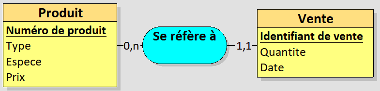
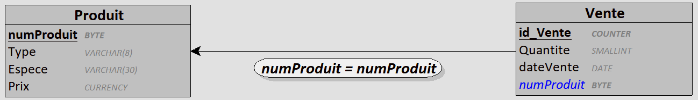
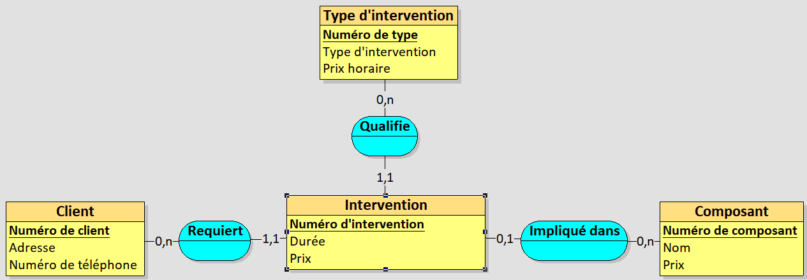
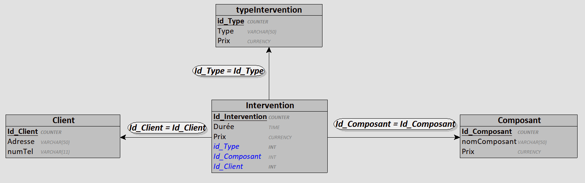
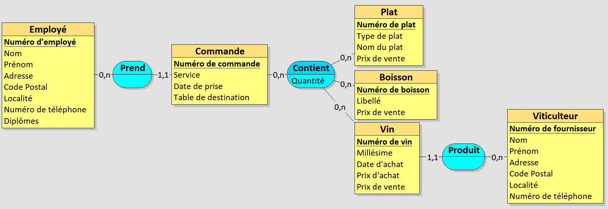
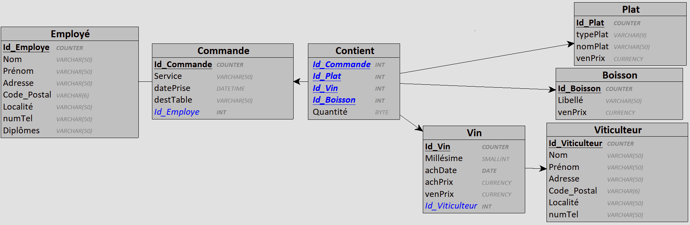

# Base de données - TP5 - Rapport

## __Exercice 1__

### <u>MCD</u>



<br>

### <u>MLD</u>

```
Produit = (numProduit BYTE, Type VARCHAR(8), Espece VARCHAR(30), Prix CURRENCY);
Vente = (id_Vente COUNTER, Quantite SMALLINT, dateVente DATE, #numProduit);
```

<br>

### <u>MPD</u>



<br>

### <u>Exemple de contenu de tables</u>

### __Produit__
|numProduit|Type   |Espece |Prix   |
|----------|-------|-------|-------|
|0         |Animaux|Lapins |20,00 €|
|1         |Animaux|Poules |30,05 €|
|2         |Animaux|Dindes |40,75 €|
|3         |Animaux|Veaux  |17,00 €|
|4         |Animaux|Cochons|24,98 €|
|5         |Légumes|Choux  |16,82 €|
|6         |Fruits |Fraises|18,23 €|

### __Vente__
|id_vente|Quantité|Date    |numProduit|
|--------|--------|--------|----------|
|0       |7       |20210202|4         |
|1       |6       |20210203|6         |
|2       |2       |20210403|5         |

<br>

## __Exercice 2__

### <u>MCD</u>

 <br>

### <u>MLD</u>

```
Client = (Id_Client COUNTER, Adresse VARCHAR(50), numTel VARCHAR(11));
typeIntervention = (id_Type COUNTER, Type VARCHAR(50), Prix CURRENCY);
Composant = (Id_Composant COUNTER, nomComposant VARCHAR(50), Prix CURRENCY);
Intervention = (Id_Intervention COUNTER, Durée TIME, Prix CURRENCY, #id_Type, #Id_Composant*, #Id_Client);
```

<br>

### <u>MPD</u>



<br>

## __Exercice 3__

### <u>MCD</u>



<br>

### <u>MLD</u>

```
Employé = (Id_Employe COUNTER, Nom VARCHAR(50), Prénom VARCHAR(50), Adresse VARCHAR(50), Code_Postal VARCHAR(6), Localité VARCHAR(50), numTel VARCHAR(50), Diplômes VARCHAR(50));
Commande = (Id_Commande COUNTER, Service VARCHAR(50), datePrise DATETIME, destTable VARCHAR(50), #Id_Employe);
Plat = (Id_Plat COUNTER, typePlat VARCHAR(9), nomPlat VARCHAR(50), venPrix CURRENCY);
Viticulteur = (Id_Viticulteur COUNTER, Nom VARCHAR(50), Prénom VARCHAR(50), Adresse VARCHAR(50), Code_Postal VARCHAR(6), Localité VARCHAR(50), numTel VARCHAR(50));
Boisson = (Id_Boisson COUNTER, Libellé VARCHAR(50), venPrix CURRENCY);
Vin = (Id_Vin COUNTER, Millésime SMALLINT, achDate DATE, achPrix CURRENCY, venPrix CURRENCY, #Id_Viticulteur);
Contient = (#Id_Commande, #Id_Plat, #Id_Vin, #Id_Boisson, Quantité BYTE);
```

<br>

### <u>MPD</u>

